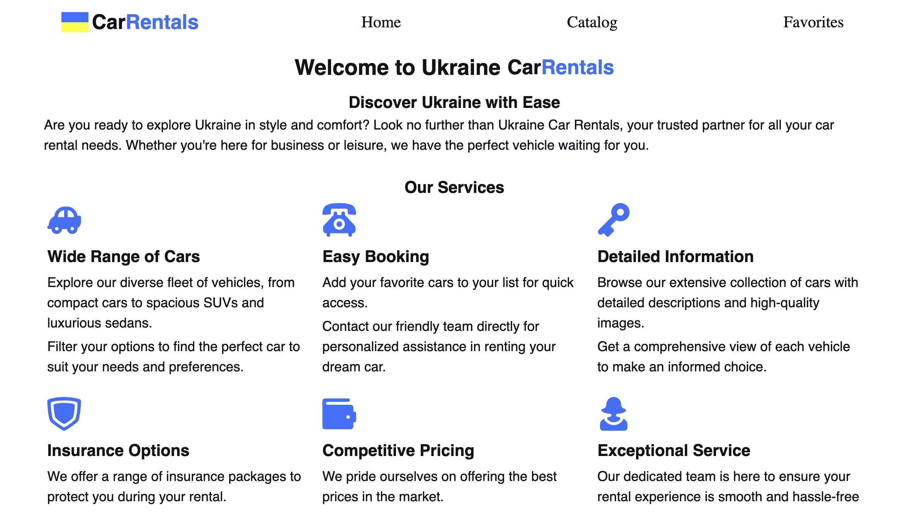
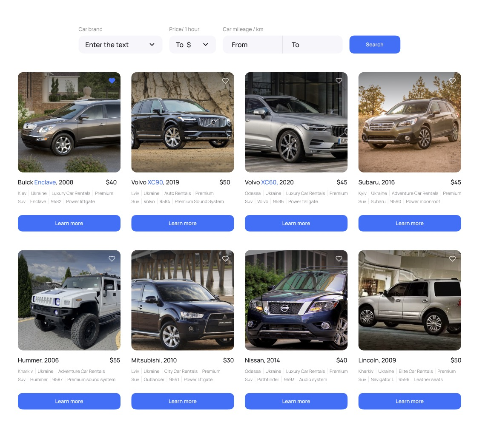
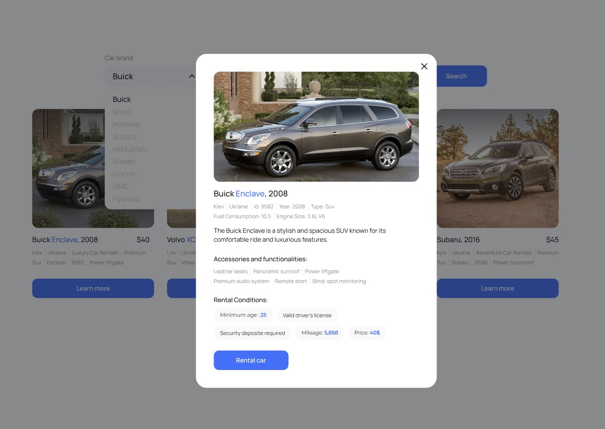

# CarRentals Website

Welcome to the CarRentals website! This web application is designed to help
users easily find and rent cars of various configurations. It's built using
Vite, providing a seamless experience for users looking to rent a car.

## Table of Contents

1. [Features](#features)
2. [Technologies Used](#technologies-used)
3. [Installation](#installation)

## Features

CarRentals offers the following key features:

1. **Home Page**: A general description of the services provided by the company.
   The stylization and design of this page are customizable to your preferences.



2. **Car Catalog Page**: This page displays a catalog of cars with various
   configurations. Users can filter cars by:

   - Brand
   - Price per hour of car rental
   - Number of kilometers covered by the car during its operation (mileage)

3. **Favorites Page**: Users can add ads to their favorites by clicking the
   "heart" button on the card. The button's color changes to indicate that the
   car is in the user's favorites.



4. **Modal Window**: When users interact with an card, a modal window appears,
   allowing them to add it to their favorites. The modal can be closed by:
   - Clicking the button in the form of a "cross"
   - Clicking on the backdrop
   - Pressing the Esc key



## Technologies Used

This project utilizes the following technologies and libraries:

- [React](https://reactjs.org/): The core library for building the user
  interface.
- [Redux](https://redux.js.org/): Used for state management of the application.
- [axios](https://axios-http.com/): Used for making HTTP requests to the UI
  service heroku.com.
- [react-loader-spinner](https://www.npmjs.com/package/react-loader-spinner):
  Used for displaying an animated loader.
- [react-redux](https://react-redux.js.org/): Helps integrate Redux with the
  React application.
- [reduxjs/toolkit](https://redux-toolkit.js.org/): Used for simplified state
  management and utilizing `createSlice` and `createAsyncThunk`.
- [react-router-dom]: Implemented for setting up routing within the application.
- [redux-persist]: Utilized for local storage persistence, ensuring data
  retention even after page reloads.
- [styled-components](https://styled-components.com/): Used for component
  styling.

## Installation

Follow these steps to set up and run the CarRentals website locally:

1. Clone this repository to your local machine:

   ```bash
   git clone https://github.com/IrynaDidkivska/rent-car-project.git
   ```

2. Navigate to the project folder: `cd your-repo-name`
3. Install dependencies: `npm install`
4. Start the application: `npm start`
